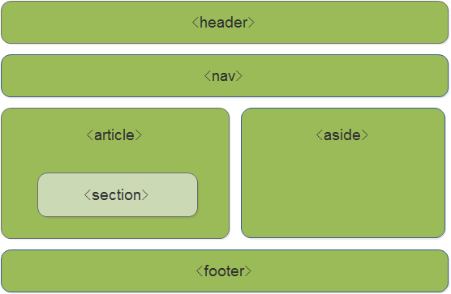

#                                              HTML

### 一、元素


##### 	1、块级元素

​	  用法：      display：block；（div、h1~h6、p等）

​	  特点：

- ​				块级元素**独占一行**，其他元素依次排在块级元素后面。
- ​				可以设置宽高，可以使用margin：0 auto ；强行水平居中。
- ​                默认的宽度是浏览页面的宽度，默认的高度是块级元素内容的高度，若没有内容则高度为零。


##### 	2、行内元素

​	  用法：	  display：inline；（span、i、em、b、li、input等）

​	  特点：

- ​                行内元素**不会独占一行**，优先排满一行，排满后会自动换行。
- ​                行内元素**不能设置宽高**，默认宽高是元素内容的宽高。
- ​                **行内元素与其他元素之间没有间距**


##### 	3、行内块元素

​	  用法：	  display：inline-block；（button等）

​	  特点：

- ​                行内块元素**不会独占一行**，优先排满一行，排满后会自动换行。
- ​                行内块元素**可以设置宽高**，默认的宽高是元素内容的宽高。
- ​                **行内块四周会有间距**，无法使用css属性清除，若要消除这些间距可以使用浮动


### 二、表格(table)与表单(form)

##### 	1、表格(table)

​				主要是用来**展示数据**，**有严格的格式要求**。

​				用法:

```html
	<table>
    	<tr>	/*tr代表的是表格中的行*/
            <th></th> 	/*th代表的是表格中的表头，会有加粗的效果，通常会写在表格的第一行*/
            <th></th>
            <th></th>
    	</tr>
    	<tr>	
            <td></td>	/*td代表的是表格中的单元格，通常与th数量相同 可以使用collapse："n"(合并的数量);来合并单元格。*/
            <td></td>
            <td></td>
    	</tr>
	</table>
```


##### 	2、表单(form)

​				主要是用来**收集数据和提交数据**，没有严格的样式要求。

​				用法：

```html
    <form action="">
        ...
        <input type="submit"> 	/*会自动整合数据提交到后台数据库*/
	</form> 
    /*action是用来填写数据所需要提交到的地址，通常是以.php结尾*/
    /*内容布局通常使用div+css为主*/
```

​	

### 三、语义化标签

​			语义化标签是HTML5中新增的属性，用来描述网页中的某个区域的，是开发者更加容易的了解该区域含义，方便了后期的维护。

​			主要分为六大类：header、nav、article、aside、footer、section，在网页中所在的区域具体如下：

​                                              

​			


##### 		

