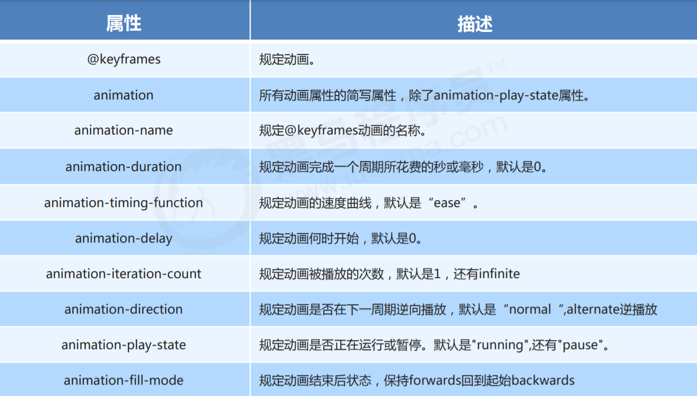
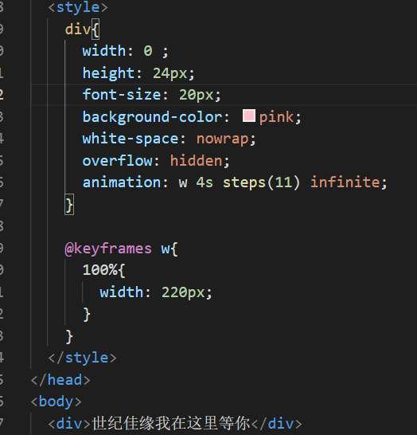
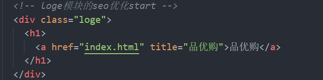
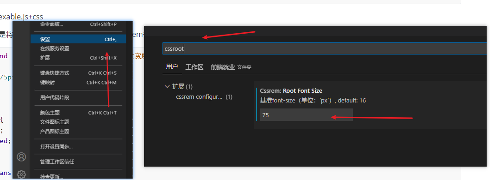

# 																						css

## 一、定位

##### 1、margin和padding

​	  margin：外边距，控制盒子与盒子之间的距离。

​	  padding：内边距，控制盒子与内容之间的距离。

​	  **使用时的注意事项：**

​	  **外边距塌陷**：两个盒子是父子关系，父盒子不设置边框，给子盒子设置margin-top会导致父盒子向上移动，而子盒子在父盒子中不               							 动，这种情况被叫做外边距塌陷。

​	  					   解决方法：

- ​												给父盒子设置boder-top：1px solid transparent。

- ​												给父盒子设置overflow：hidden

  **外边距合并**：两个盒子是兄弟关系，第一个盒子设置margin-bottom：20px，第二个盒子设置margin-top：25px。理论上两个盒子					   之间的距离为45px，但是实际上只有25px，这就叫做外边距合并。
  
  

##### 2、相对定位（relative）

​	  相对与自身原来的位置进行定位，**不会脱离标准流**。

​	  用法：position:relative;

​	  **注：如果给position:relative设置left时，会使元素整体向右移动，而宽度不会自适应改变，导致浏览器上出现横向滚动轴。**

​			  **若无特殊情况不给position:relative元素设置top，left，right，bottom值。若一定需要给body设置overflow:hidden.**


##### 3、绝对定位（absolute）

​	  相对于父标签来进行定位，若一直找不到父标签则对于body标签来进行定位，也会**脱离标准流**，不会再占用原来的位置。

​	  js中的轮播图的淡入淡出的原理。

​	  用法：position:absolute;


##### 4、固定定位（fixed）

​	  固定到页面的某个区域，不管怎么移动页面都不会改变其位置。可以给其设置z-index提高其在z轴显示权重，永远使其在上方显示。

​	  用法:position:fixed;

​	  **注：在使用固定定位的时候需要给其设置宽度，他不会继承父类的属性。若用max-width或者min-width同样需要其写上。**

```css
	<div>
            position: fixed;
            width: 100%;
            height: 44px;
            overflow: hidden;
            max-width: 640px;
            min-width: 320px;
	</div>
```


##### 5、浮动（float）

​	  脱离标准流，去浮动到页面的右侧或左侧。

​	  用法：float：right/left；(常用)

​	  缺陷：会造成父标签的高度塌陷，影响页面布局。

​	  解决方法：清除浮动：方法一：伪元素。**（伪元素中一定要有content的属性）**

​						 .clearfix::after{

​									**content:"";**

​									display:block;

​									clear:both;

​									height:0;

​									visibility:hidden;

​							}

​											方法二：双伪。

​							.clearfix::after,clear::brfore{

​									content:"";

​									display:table;

​							}

​							.clearfix::after{

​									clear:both;

​							}


##### 6、流式布局（了解）

​	  即在开发过程中，不会给div等元素固定的宽，给他们宽设置百分比，大盒子中设置width：100%，不设置高，让其中的内容将其撑大。**一般只给宽设置百分比，不给高百分比。**


##### 7、★弹性布局（flex）

​	  有兼容问题，移动端常用，若不考虑兼容，pc端也可以用。

​	  用法:**display:flex;**

​	  给父级设置这个属性后，该父级元素变为容器，其下的子元素变成项目。

​	  **父级元素相关属性：**

​			**flex-direction**:row | column; **(设置主轴的方向，默认是row)**

​			**flex-wrap:** wrap | nowrap**;(默认是nowrap)**

​			**justify-content**:    flex-start    	|		 flex-end 		| 		**space-between**		 |		space-around 		| 		**center**;  

​								  	 	 默认从左到右			   从右到左				两端靠边，中间平分			全部元素边距相同					居中

​	  		**（justify-content是设置元素在主轴上的排序样式）**


​			   **align-items**:    flex-start    	|		 flex-end 		| 		**center**		|	 	stretch;  

​								     默认从左到右			   从右到左	        		  居中				之元素拉升（子元素不设置高）

​				**(align-items是设置单行元素在侧轴上的排序方式)**			


​			  **align-content**:    flex-start    	|		 flex-end 	| 	**space-between**		 |	space-around 	| 	**center**	|			stretch;  

​								     	默认从左到右	 	  从右到左		  	两端靠边，中间平分			平分剩余空间			    居中			之元素拉升（子元素不设置高）

​				**(align-content是设置多行元素在侧轴上的排列方式)**


​				**flex-flow**: 主轴方向 是否换行；(复合属性,了解即可)


​		 **子元素相关属性：**

​				**flex**:	number;	(number可以是任何数字，即该元素占父元素空白区域的百分比)

​				**align-self**: flex-start	|	flex-end	|	center

​								   在侧轴头		  在侧轴尾	   在侧轴中间			

​				**order**: number ;	(默认是0，数值越小，元素越在前面)


##### 8、栅栏布局（grid）:bootstrap使用的原理.


## 二、盒子模型

##### 	1、标准盒模型

​	  用法：box-sizing:content-box;（默认）

​	  width(最终)=padding+width(设置)+border.   （默认是标准盒模型）


##### 	2、★怪异盒模型

​	  用法：box-sizing:border-box;

​	  width(最终)=width(设置)，padding和border均在设置的width里面 （css3新增的盒模型），低版本浏览器会有兼容问题。

​	 

## 三、动画和过渡

##### 1、过渡

​		使元素变化的时候更加圆滑。

​		用法：

​				transition：变换元素 变换时间 运动曲线(默认ease) 延迟时间；(变换元素建议使用all)


##### 	2、2D转换

​		使元素在x轴和y轴上进行平移，倾斜，缩放。

​		用法：

​					transform：translate（x，y）/rotate(xdeg)/scale（x）；

​					**translate**是使元素在x轴和y轴上进行偏移，**对行内元素没用**。

​					**rotate**是使元素进行旋转的角度。

​					**scalc**是使元素进行缩放的倍数，1等于不缩放，可以是小数。`

​					**rotate和scalc可以对其设置偏移中心点，**

​								**用法transform-orgin:x，y**。

​								x,y可以是**具体值，百分比、关键字**（bottom、top、left、right、center）

​					**tranform 代码执行有先后顺序，一般情况下，位移写在最前面。若旋转写在最前面，会导致轴线改变，位移达不到**

​					**想要的效果， ** **但需要轴线进行改变时，可以先翻转在位移**

​			

##### 3、3D转换

​		使元素沿着x轴，y轴，z轴进行翻转或者平移。

​		用法：

​				translatex轴和y轴用法与2D转换相同。

​				z轴：**使用时需要给他的上级添加透视   perspective：x px**(x为眼睛距离屏幕的距离，x越大，看到的元素越小，反之则越大)

​						  transform：translateZ(zpx);(z值越大元素距离我们眼睛越近，元素看着越大)

​				rotate：

​							transform：rotateX(xdeg) / rotateY(ydeg) / rotateZ(zdeg); **(其中的x，y，z是沿着x轴、y轴、z轴进行翻转的度数)**

​		**注：当给子盒子设置3D效果的后，再给父级添加动画，在动画的过程中会看不到子盒子的3D效果，需要给父盒子设置**

​				**transform-style:preserve-3d; 原因是父盒子的transform-style默认为flat，即不保留子元素的3D效果，所以**

​				**需要手动开启** 


##### 4、动画 

​		是使元素根据某种设定进行相应的移动。

​		用法：

​					**a、定义函数**

​						  @keyframes 函数名{

​									0%{

​												转换效果

​									}

​									...	

​									100%{

​												转换效果

​									}

​							}

​					**b、引用**

​							animation: name     duration   timing-function    delay      iteration-count   direction         fill-mode;

​												函数名   使用时间        运动曲线         延迟时间        循环次数        是否逆循环	最后停止的位置

​							详细图解：

​						**注：animation-iteration-count:steps（）.steps是将动画分为几个部分来进行。当设置无线循环，最后一步会无法显示，所以需要多设置一个，并且需要将宽度进行相应增大，实例如下。**




## 四、seo优化（搜索引擎优化）

##### 	1、使用网站TDK三大标签优化seo

###### 			a、title标签：

​			建议：网站名（产品名）- 网站的介绍 （尽量不要超过30个汉字） 

​			例如： 京东(JD.COM)-综合网购首选-正品低价、品质保障、配送及时、轻松购物！

​						 小米商城 - 小米5s、红米Note 4、小米MIX、小米笔记本官方网站

###### 			b、description 网站说明。

​			例如：<meta name="description" content="京东JD.COM-专业的综合网上购物商城,销售家电、数码通讯、电脑、

​                		家居百货、服装服饰、母婴、图书、食品等数万个品牌优质商品.便捷、诚信的服务，为您提供愉悦的网上购物
​						体验!" />

###### 			c、keywords关键字。

​			例如：<meta name= " keywords" content="网上购物,网上商城,手机,笔记本,电脑,MP3,CD,VCD,DV,相机,数码,配

​						件,手表,存储卡,京东" />

##### 2、loge中seo优化

- ​	logo 里面首先放一个 h1 标签，目的是为了提权，告诉搜索引擎，这个地方很重要。

- ​	h1 里面再放一个链接，可以返回首页的，把 logo 的背景图片给链接即可。

- ​	为了搜索引擎收录我们，我们链接里面要放文字（网站名称），但是文字不要显示出来。 

- ​				方法1：text-indent 移到盒子外面（text-indent: -9999px) ，然后 overflow:hidden ，淘宝的做法。  

- ​				方法2：直接给 font-size: 0; 就看不到文字了，京东的做法。

- ​	最后给链接一个 title 属性，这样鼠标放到 logo 上就可以看到提示文字了。

- ​	实例：**（品优购(shopping)loge的seo优化）**


​				

​				

### 五、给元素设置水平或者垂直居中的方法

##### 		1、给文本设置水平垂直居中

```css
       <style>
                div{
                     height:30px
                     text-align:center;
                     line-height:30px
                }
	   </style>
```


##### 		2、给行内块元素设置水平垂直居中

```css
 	   <style>
                div{
                    vertical-align: middle;
                    text-align:center;
                }
	   </style>
```


##### 		3、给块级元素设置水平垂直居中

```css
	  /* 方法一 给定宽高*/
	   <style>
            div{
                width:100px;
                heigt:100px;
                postive:absotule;
                top:50%;
                left:50%;
                margin-left:-50px;      /* 左边和上边的偏移量是宽度和高度的一半 */
                margin-top:-50px;
            }
	   </style>

	  /* 方法二 万能*/
	   <style>
            div{
                display: flex;
                justify-content: center; 	/* 水平于轴线居中 */
                align-items: center; 	/* 垂直于轴线居中 */
            }
	   </style>
```


## 六、移动端web

##### 1、视口：浏览器显示页面内容的区域。

​				**布局视口**：网页在pc端布局的大小，在移动端上字体会变小，页面需要左右移动才可以看的完整。

​				**视觉视口**：用所看到的视口，即手机屏幕的大小。

​				**理想视口**：网页的布局视口 = 视觉视口。理想视口使用的方法：

```css
<meta name="viewport" content="width=device-width, initial-scale=1.0，user-scalable=no,maximum-scale=1.0,minimum-scale=1.0">
```


##### 2、background-size：设置背景图片大小。

​				**background-size: 像素 | 百分比 | cover | contain；**

​				**cover**:是将背景图片等比缩放，直至可以完全充满整个div。可能会导致图片看的不完整。

​				**contain**：也是将背景图片等比缩放，只要宽或者高有一个到达了div的宽或者高就停止缩放。可能会导致div没有充满整个div。


##### 3、less(css预处理器)

​		less是css的预处理器，它在 CSS 的语法基础之上，引入了变量，Mixin（混入），运算以及函数等功能，大大简化了 CSS 的编写，并且 降低了 CSS 的维护成		本，就像它的名称所说的那样，Less 可以让我们用更少的代码做更多的事情。

​		**a、变量**：便于后期维护

```css
@baseFont:50px;
div{
    width:@baseFont;(等价于width：50px)
}
```

​		**b、嵌套**：儿子写在父亲里，**要给其设置伪元素设置时要在其加上&符号**

```css
div{
    width:10rem;
    img{
        width:100%
    }
    &:hover{
        background-color:pink;
    }
}
```

​		**c、运算**：在less中可以使用 +、-、*、/ 进行运算，注意单位，**一个有单位时以一个为准，二个都有单位以第一个为准，使用/的时候需要添加括号，每个运算符号前后都需要加空格。**

```css
@baseFont:50px
div{
    width:(200rem / @baseFont);			/*width:4rem*/
}
```


##### 4、rem 与 em 、流式布局、rem布局（rem布局必备）

###### 	a、rem于em

​				em是相对于父类的字体大小来设置的

```css
div{
    font-size:12px
}

div span{
    display:block
    width:10em; 			/*实际宽高为120px*/
    height:10em;
}
```

​				rem是相对于根元素下的字体大小来设置的

```css
html{
    font-size:14px;
}
div{
    font-size:12px
}

div span{
    display:block
    width:10rem; 			/*实际宽高为140px*/
    height:10rem;
}
```

###### 		b、流式布局

​				不给元素设置固定宽，给其设置百分比宽，让其元素随着屏幕变化而变化。

​				不足：只能给元素设置宽高，不能给其中内容设置，屏幕大小变化时候，里面的元素和字体等不会变化，会使页面不够美观。


###### 		c、rem布局

​				**第一种：less+rem**

​				页面中的所有元素的值全部设置rem单位，页面中的所有元素都会随着屏幕变化而变化，通常搭配less使用。

​				**原理**：将一个页面分为10份、15份、20份等（具体情况具体对待），其中的一份的大小就作为1rem，其他元素我们只需要设置占元素的多少就可以了。

​				案例：苏宁首页部分：

```html
<div class="search-content">
    <a href="" class="classify"></a>
    <div class="search">
      <form action="">
        <input type="search" placeholder="厨卫保暖季 每千减百">
      </form>
    </div>
    <a href="" class="login">登录</a>
  </div>
```

```css
.search-content{ /*部分代码*/
  display: flex;
  position: fixed;
  top: 0;
  left: 50%;
  transform: translateX(-50%);
  width: 15rem;
  height: (88rem / @baseFont);
  background-color: #fbc043;
  .classify{
    width: (44rem / @baseFont);
    height: (70rem / @baseFont);
    margin: (11rem / @baseFont) (25rem / @baseFont) (7rem / @baseFont) (24rem / @baseFont);
    // background-color: blue;
    background: url(../images/classify.png) no-repeat;
    background-size: (44rem / @baseFont) (70rem / @baseFont);
  }
}
```

​				第二种：flexable.js+css

​				flexable.js是将页面固定分为10份，再用css布局的rem去改变样式。

```css
@media screen and (min-width:750px){ /*给其设置最大宽度 必备*/
  html{
    font-size: 75px!important;
  }
}

.search-content{
  display: flex;
  position: fixed;
  top: 0;
  left: 50%;
  transform: translateX(-50%);
  width: 10rem;
  height: 1.173333rem;
  margin: 0 auto;
  background-color: #fbc043;
}

.classfiy{
  width: .586667rem;
  height: .933333rem;
  background: url(../images/classify.png) no-repeat;
  background-size: .586667rem .933333rem;
  margin: .146667rem .333333rem .093333rem;
}
```

tips：vs插件cssrem 可以快速将px单位变成rem单位，使用方法如下：




##### 5、媒体查询（media）

​		作用：通过不同屏幕的大小来设置不用的样式。

​		用法：@media(媒体查询必备)	 **mediatype(媒体类型)** 	**and|not|only(关键字)** 	(**media feature(媒体特性)**) { 

​							CSS-Code;   （只要满足媒体特性的情况下，所对应的样式）

​					 }

​					mediatype:	**all**				  适用于所有设备

​											**print**			 用于打印机和打印预览

​											**scree**			用于手机，电脑，平板电脑


​					关键字:			**and**			   可以多个特性一起用

​											**not** 				排除某个特性 | 不包含该特性

​											**only** 			  只能有一个特性


​					媒体特性：	 **min-width** 	设置屏幕的最小值，等价于>=

​											**max-width**	 设置屏幕的最大值，等价于<=


​		使用范围：1、配合rem布局使用，用来设置不同屏幕下的**html的字样样式**，以便样式在不同的屏幕下大小进行改变。（主要针对**移动端**）

​						   2、配合响应式布局使用，用来设置不同**设备（电脑、手机、平板）下样式**，以便在不同的设备上都可以适配。（**pc端、移动端**都用）