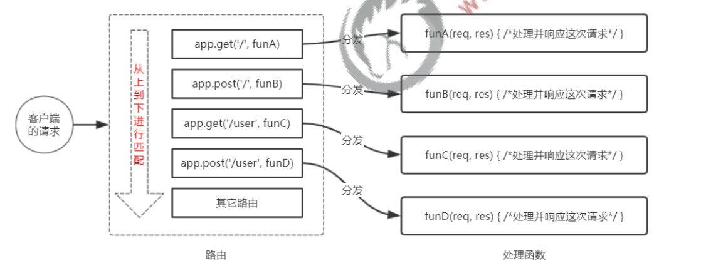
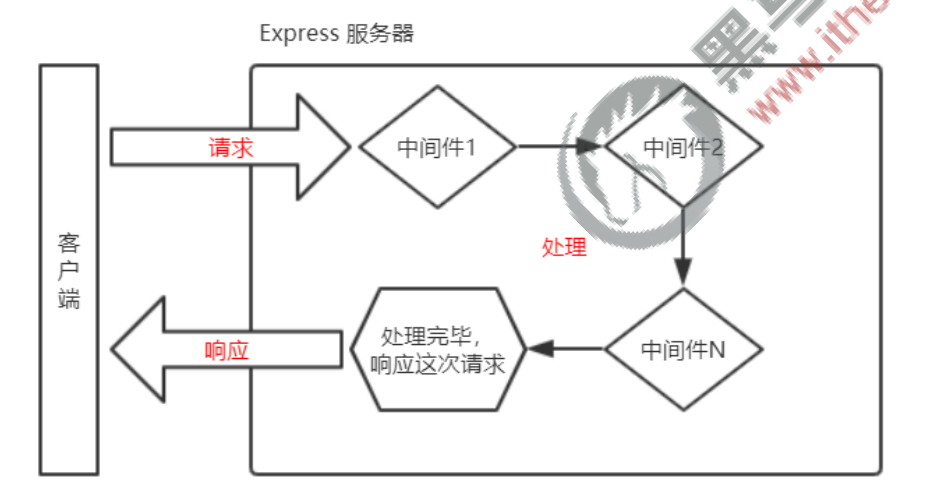
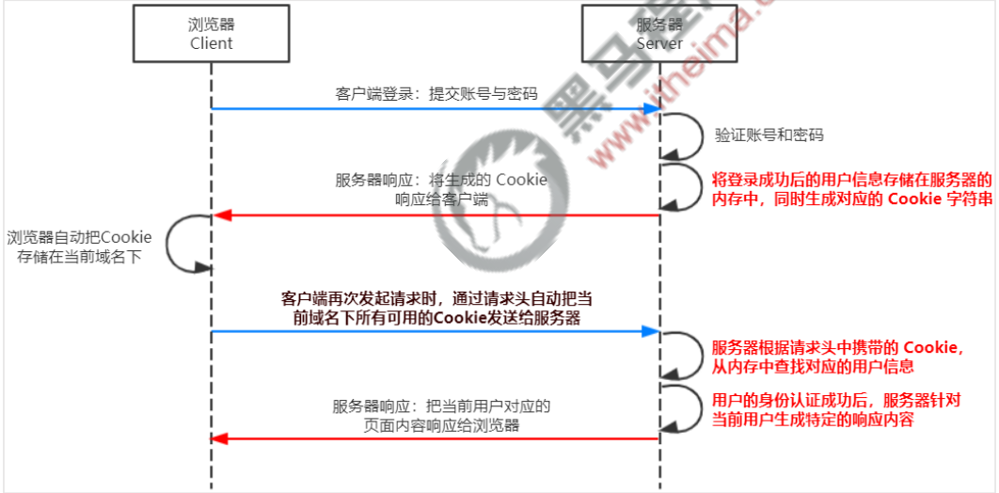
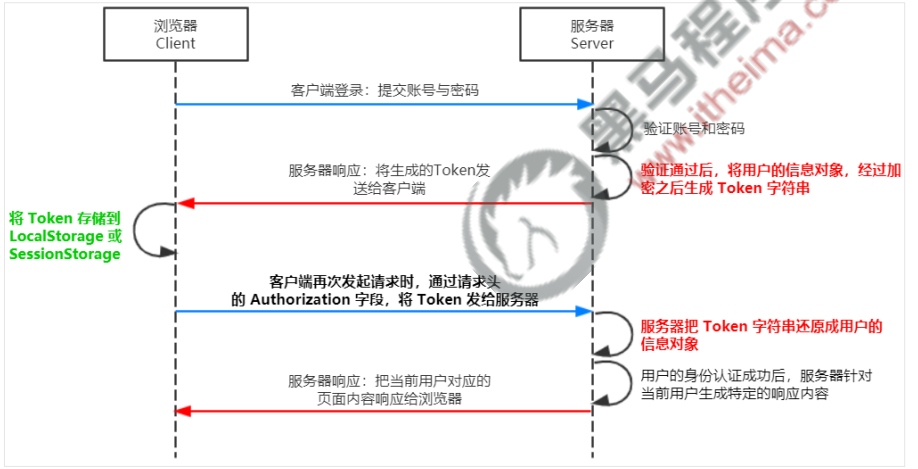

# node

​					node就是搭建V8引擎的JavaScript的后端运行环境

## 一、内置模块

### 1.1、fs模块与方法

```js
//导入fs模块
const fs = require('fs');

//读取文件    fs.readFile(path,编码格式,function(err,dataStr){})
fs.readFile('./index.html','utf-8',function(err,dataStr){					//读取中文文件时 一定要设置编码格式为utf-8
    if(err)   return console.log('读取文件失败' + err.message);				//有err对象代表读取失败 返回读取失败的信息
    console.log('读取成功' + dataStr)										 //没有err对象说明读取成功 返回读取到的内容dataStr	
})

//写入文件	  fs.writeFile(path,写入的数据,function(err){})		写入的数据可以为空
fs.writeFile('./demo/aa.txt','123',function(err){				
    if(err)   return console.log('写入失败' + err.message);
    console.log('写入成功')
})

```


### 1.2、path模块与方法

```js
//导入path模块
const path = require('path');

//__dirname 是node里面自带的一个属性	返回的是当前文件所在的路径

//path.join('/a','./b','../c/d')   最终返回a/c/d	./代表和当前路径同级  ../代表是当前路径的上一个路径
path.join(__dirname,'/demo/index.html');					//解决路径的动态拼接问题

//path.basename(path,[ext])    返回的是文件夹
path.basename('a/b/c/d/index.html')							//返回的是index.html
path.basename('a/b/c/d/index.html','.html')					//返回的是index

//path.extname(path)			返回的是文件的拓展名
path.basename('a/b/c/d/index.html')							//返回的是.html
```


### 1.3、http模块与方法

```js
//导入http模块
const http = require('http');

//创建http服务
const server = http.createServer();

//监听请求事件		req是客服端传递的参数对象  res是返回给客户端对象
server.on('request',function(req,res){
    var	url = req.url;							//获取客户端的url地址
    res.end(url);								//将url信息现在到客户端上
})

//开启服务器
server.listen(80,function(){
    console.log('服务器启动成功 地址是127.0.0.1:80')
})

//注：如果通过res.end将中午返回给客户端页面 需要设置响应头为utf-8
res.setHeader('Content-Type','text/html;charset=utf-8');
```


## 二、模块化

​			将一个复杂的项目分解成多个小模块   将这些小模块组合起来就是一个完整的项目   如何需要更改相关功能   只需要更改相关模块的功能既可

​			优点：**可复用   	可维护性强		按需加载**


### 2.1、module模块

​			 module模块是在导入包的时候 都会存在的模块 其中exports是该包向我们暴露的对象

```js
const fs = require('fs');
console.log(module.exports);				//输出是fs模块暴露出来的对象
```

​			**注**：exports等价于module.exports，但我们要记住 **我们永远只导入module.exports里面的内容** 一般情况下不要在一个文件中同时使用这两个变量


## 三、包

​				Node.js 中的第三方模块又叫做包    由于 Node.js 的内置模块仅提供了一些底层的 API，导致在基于内置模块进行项目开发的时，效率很低。 包是基于内置模块封装出来的，提供了更高级、更方便的 API，极大的提高了开发效率。

###  

### 3.1、安装与卸载包

```
# 安装包
npm install 包名

# 安装全局包
npm install 包名 -g

# 卸载包
npm uninstall 包名

# 卸载全局包
npm uninstall 包名 -g
```

之后的具体使用过程可以看当前包的文档 		官方文档： https://www.npmjs.com/


### 3.2、文件中package.json和node_module

​				在安装完包后 文件夹中会自动生成这两个文件 package.json中包含包名、版本号、作者等相关信息   node_module中包含该包中的源码。

​				**注**：在我们使用git将代码同步到云仓库中 由于node_module文件太大 影响传输效率 通常我们会在.gitignore文件中忽略掉 不去同步到云端

​						但在别人clone我们代码的使用 由于没有安装我们相关的包 是没法运行我们的项目 所以需要使用npm install去安装我们项目所需要的依赖

​						因为我们在package.json中记录的包的名称和版本号 所以可以通过npm	install进行下载

​						一般情况下 我们不去手动修改package.json里面的内容 	npm 会自动帮我们管理

```
# 安装package.json文件
npm init -y
```


**开发依赖包**：在开发的过程中 所需要用到的包  文件名和版本号存储在package.json中**devDependencies**对象下

```
# 安装 开发依赖包
npm install 包名 -D

# 卸载 开发依赖包
npm uninstall 包名 -D
```

**核心依赖包**：在开发和线上版本都需要使用的包  文件名和版本号存储在package.json中**dependencies**对象下  默认情况下安装的就是核心依赖包

```
# 安装 核心依赖包
npm install 包名

# 删除 核心依赖包
npm uninstall 包名
```


**package.json中main对象的含义**：main对象的值 代表的是当前文件的入口函数 在导入这个文件的时候会优先执行main里面的.js文件  若没有则执行当前文件更															 目录下的index.js文件  若都没有则返回404


## 四、模块的加载机制

### 4.1、优先从缓存中加载

​				模块在第一次加载后会被缓存。 这也意味着多次调用 require() 不会导致模块的代码被执行多次。 注意：不论是内置模块、用户自定义模块、还是第三方模块，它们都会优先从缓存中加载，从而提高模块的加载效率。

```js
//虽然导入了三次包 但是只会执行一次 
const my = require('./my');
const my = require('./my');
const my = require('./my');
```


### 4.2、内置模块的加载机制

​				内置模块是由 Node.js 官方提供的模块，内置模块的加载优先级最高。 例如，require('fs') 始终返回内置的 fs 模块，即使在 node_modules 目录下有名字相同的包也叫做 fs。

```js
//以内置模块为主
const myfs = require('./fs');
const fs = require('fs');
```


### 4.3、自定义模块的加载机制

​				使用 require() 加载自定义模块时，必须指定以 ./ 或 ../ 开头的路径标识符。在加载自定义模块时，如果没有指定 ./ 或 ../ 这样的路径标识符，则 node 会把它当作内置模块或第三方模块进行加载。	

​				同时，在使用 require() 导入自定义模块时，如果省略了文件的扩展名，则 Node.js 会按顺序分别尝试加载以下的文件：

​				 	① 按照确切的文件名进行加载 

​				 	② 补全 .js 扩展名进行加载

​				 	③ 补全 .json 扩展名进行加载 

​				 	④ 补全 .node 扩展名进行加载 										（.node扩展名是win32位编码文件）

​				 	⑤ 加载失败，终端报错


### 4.4、第三方模块加载机制

​				如果传递给 require() 的模块标识符不是一个内置模块，也没有以 ‘./’ 或 ‘../’ 开头，则 Node.js 会从当前模块的父 目录开始，尝试从 /node_modules 文件夹中加载第三方模块。 **如果没有找到对应的第三方模块，则移动到再上一层父目录中，进行加载，直到文件系统的根目录。**

​				例如，假设在 'C:\Users\itheima\project\foo.js' 文件里调用了 require('tools')，则 Node.js 会按以下顺序查找：

​						 ① C:\Users\itheima\project\node_modules\tools 

​						 ② C:\Users\itheima\node_modules\tools 

​						 ③ C:\Users\node_modules\tools

​						 ④ C:\node_modules\tools


## 五、express第三方模块

​				express与node.js中http模块类型 	都是用来创建web服务器的 	但他将http模块进行模块封装   比原本的http模块创建web服务器更加快速 更加极简


### 5.1、使用express简单创建一个服务器

```js
//导入包
const express = require('express');

//创建web服务器
const app = express();

//启动服务器
app.listen(80,()=>{
    console.log('服务器启动成功   http://127.0.0.1:80')
)
```


### 5.2、监听get和post请求

```js
//app.get(path,[中间块]，function(req,res){})
app.get('/user/list',function(req,res){
    res.send({name:'zs',age:20});						//服务器向客户端返回数据  返回的是json字符串
})

//app.post(path,[中间块]，function(req,res){})
app.post('/user/add',function(req,res){
    res.send('添加成功');						
})
```


### 5.3、获取查询参数和动态参数

```js
//获取查询参数req.query  get请求传递过来的data对象  例如：http://127.0.0.1/?id=1&username=ls
app.get('/',function(req,res){
    console.log(req.query);					//在服务器中打印查询参数	返回的值为 {"id":"1","username":"ls"}					
})

//获取动态参数req.params	语法 /:属性值1/:属性值2/:属性值n		例如：http://127.0.0.1/1/zs
app.get('/:id/:username',function(req,res){
    console.log(req.params);				//返回的值为{"id":"1","username":"ls"}
})
```


### 5.4、托管静态资源包

```js
//使用express.static
const express = require('express');
const path = require('path')

const app = express();

// 同时暴露多个页面   谁在前面谁先显示
app.use(express.static('./file'));

// 挂载浏览器访问前缀
// app.use('/clock',express.static('./clock'));       //访问是需要通过路径 + /abc/index.html页面进行访问

//解决路径动态拼接的问题
app.use('/clock',express.static(path.join(__dirname,'/clock')))

app.listen(80,function(){
  console.log('启动成功');
})
```


### 5.5、express路由

#### 5.5.1、路由的匹配过程

​				每当一个请求到达服务器之后，需要先经过路由的匹配，只有匹配成功之后，才会调用对应的处理函数。 在匹配时，会按照路由的顺序进行匹配，如果请求类型和请求的 URL 同时匹配成功，则 Express 会将这次请求，转 交给对应的 function 函数进行处理。




#### 5.5.2、实现一个简单的路由(路由模块化)

```js
//路由模块化		自定义路由模块包
const express = require('express');
const router = express.Router();

router.get('/user/list',function(req,res){
    console.log('这是一个简单的get路由')
})

router.post('/user/add',function(req,res){
    console.log('这是一个简单的post路由')
})

//向外暴露router对象 
module.exports = router;
```

```js
const express = require('express');
const app = express();
const myrouter = require('./router.js')

//定义一个简单的路由 
//app.get('/user/list',function(req,res){
//    console.log('这是一个简单的路由')
//})

//注册模块
app.use(myrouter);

app.listen(80,()=>{
    console.log('服务器启动成功 http://127.0.0.1:80')
})

//在浏览器中访问该地址 会依次打印	这是一个简单的get路由	这是一个简单的post路由
```


#### 5.5.3、为路由添加前缀

```js
app.use('/api',myrouter)
```


### 5.6、中间件

#### 5.6.1、概念与调用流程

​				概念：中间件（Middleware ），特指业务流程的中间处理环节。

​				调用流程：当一个请求到达 Express 的服务器之后，可以连续调用多个中间件，从而对这次请求进行预处理。




#### 5.6.2、定义一个简单的中间件函数

```js
const express = require('express');
const app = express();

// //定义一个简单的中间件    特点 : 中间件中包含next函数
// const mw = function(req,res,next){
//   console.log('这是一个最简单的中间件');

//   // 将流转关系 转到下一个中间件或者是路由		若不写这行代码 程序将在这行卡住 不会去执行之后的中间件或者路由
//   next();
// }

// // 将mw注册成为全局的中间件 在执行是先经过中间件再去执行之后的路由或者中间件
// app.use(mw);

// 简化定义中间件
app.use(function(req,res,next){
    const time = Date.now();
    // 中间件与路由之间的req和res是共享的 在上游中间件上挂载属性 下游的中间件和路径也可以进行访问
    req.startTime = time;
    // 将流转关系 转到下一个中间件或者是路由		若不写这行代码 程序将在这行卡住 不会去执行之后的中间件或者路由
    next();
  })

app.get('/',function(req,res){
  res.send('home page' + req.startTime);
})

app.get('/user',function(req,res){
  res.send('user page' + req.startTime)
})

app.listen(80,function(){
  console.log('启动成功 http://127.0.0.1');
})
```

**注: **① 一定要在路由之前注册中间件 

​	  ② 客户端发送过来的请求，可以连续调用多个中间件进行处理

​	  ③ 执行完中间件的业务代码之后，不要忘记调用 next() 函数 

​	  ④ 为了防止代码逻辑混乱，调用 next() 函数后不要再写额外的代码 

​	  ⑤ 连续调用多个中间件时，多个中间件之间，共享 req 和 res 对象


```js
//定义多个中间件
const mw1 = function(req,res,next){
    console.log('这是中间件一');
    next();
}

const mw2 = function(req,res,next){
    console.log('这是中间件二');
    next();
}

const mw3 = function(req,res,next){
    console.log('这是中间件三');
    next();
}

//暴露多个全局中间件  中间用，隔开  之后的路由和中间件必须经过mw1和mw2之后 才去执行之后的代码
app.use(mw1,mw2);				//app.use([mw1,mw2])另一种写法

//定义一个局部的中间件   在执行app.get时先经过mw1和mw2中间件后 还需要去执行mw3中间件 才会执行之后的程序
app.get('/user',mw3,function(req,res){
    res.send('这是GET请求');
})
```


### 5.7、错误级别的中间件

​				用来捕获一个服务器中的错误 防止程序崩溃  **它与其他中间件不同的一点就是 他需要写在所有路由和中间件后面**

```js
const express = require('express');
const app = express();

//写一个简单的路由
app.get('/',function(req,res){
    //人为手动抛出一个错误
    throw new Error('服务器内部错误')
    res.send(req.query);						//抛出错误时  之后的代码不在执行
})

//错误级别的中间件    function(err,req,res,next){}		错误级别的中间件比普通中间件多一个err形参
//若没有错误级别的中间件 用户访问客户端会导致页面崩溃  若有该中间件则会返回报错信息 程序不会崩溃
app.use((err,req,res,next) => {
    //在服务器端打印错误信息
    console.log("Error:" + err.message);
    //将错误信息返回给客户端
    res.send("Error:" + err.message)
})

app.listen(80,function(){
    console.log('服务器已经启动  http://127.0.0.1')
})
```


### 5.8、自定义中间件模块

```js
//中间件模块
var URLSearchParams = require('url-search-params');			//导入第三方处理JSON数据和表单数据的包

function myParams(req,res,next){
  let str = "";
  // 数据提交时 会触发该事件
  req.on('data',function(chunk){
      // 将提交的数据进行拼接
      str += chunk
  })

  // 数据提交完成时 会触发该事件
  req.on("end",function(){
    // 打印客户端传递来的数据   是字符串格式的数据
    // console.log(str);
    // TODO:将字符串解析成为对象
    // const body = qs.parse(str);
    const body = new URLSearchParams(str);
    console.log(body);
  })

  next();
}

module.exports = myParams;


----------------------------------------------------------------------------------------------------------------------------


//启动web服务器
const express = require('express');

const app = express();

//该模块已被弃用 建议使用url-search-params模块
// const qs = require('querystring');

//导入自己的中间件模块
const myParams = require('./自定义中间件模块化');

app.use(myParams)

app.get('/user',function(req,res){
    res.send('ok')
})

app.listen(80,function(){
  console.log("http://127.0.0.1");
})
```


### 5.9、自定义接口

```js
//启动web服务器
const express = require('express');

const app = express();

//处理表单传递过来的数据
app.use(express.urlencoded({extended:false}))

//导入cors模块  解决跨域问题
const cors = require('cors');

//将cors在全局定义
app.use(cors())

const apirouter = require('./apiRouter');

//为所有接口添加api访问前缀
app.use('/api',apirouter)

app.listen(80,function(){
  console.log('服务器启动成功 http://127.0.0.1');
})


---------------------------------------------------------------------
    
    
//接口模块		apiRouter.js
const express = require('express');

const router = express.Router();

router.get('/user',function(req,res){
    //获取查询字符串
    let query = req.query;
    res.send({
      status:0,
      msg:'GET请求成功',
      data:query
    })
})

router.post('/add',function(req,res){
  //获取表单数据
  let body = req.body;
  res.send({
    status:0,
    msg:'POST请求成功',
    data:body
  })
})

module.exports = router;    
```


# MySQL相关知识

## 一、sql语句增删改查

**查询：**

```sql
-- 查询user表中所有的数据
select * from user

-- 查询user表中username和password数据
select username,password from user

-- 为查询出的username和password起别名
select username as uname , password as upwd from user

-- 查询user表中id > 2并且status = 0的数据   其中不等于号用 <> 或者 != 来表示
select * from user where id > 2 and status = 0

-- 查询user表中id > 2或者status = 0的数据
select * from user where id > 2 and status = 0

-- 将查找出来的数据按照id升序排序			asc代表的是升序 默认是升序排序 可以忽略不写
select * from user order by id asc 

-- 将查找出来的数据按照id降序排序
select * from user order by id desc

-- 先按照状态进行降序排序  再对username进行升序排序
select * from user order by status desc,username asc;
```


**增加：**

```sql
-- 向user表中插入数据 其中username=wangwu  password=666666
insert into user(username, password) values ('wangwu','666666');
```


**修改：**

```sql
-- 修改id = 2 密码为qazwsxedc   注：一定要添加where子句 不然回导致将数据库中所有数据的密码都改变成qazwsxedc
update user set password='qazwsxedc' where id=2;

-- 修改id = 1 密码为123456789 username为zhangsan 
update user set username='zhangsan',password='123456789' where id=1;
```


**删除：**

```sql
-- 删除id=4的数据
delete from user where id=4;
```


## 二、连接数据库

```
# 先下载第三方库 mysql
npm i mysql
```

```js
const mysql = require('mysql');

//连接数据库
const db = mysql.createPool({
  //数据库ip
  host:'127.0.0.1',
  //数据库ip端口 默认是3306以不写
  post:3306,
  //用户名
  user:'root',
  //用户密码
  password:"admin123",
  //数据库名称
  database:'demo-db'
})

// 操作数据库  第一个参数传入的是sql语句  err是错误信息 result是成功的参数
db.query('select 1',(err,result)=>{
  //若链接数据库发生错误 则返回报错信息
  if(err) return console.log(err.message);
  // 打印sql执行成功的结果
  console.log(result);
})

// 查询user表中所有数据
const sqlStr = 'select * from user';
db.query(sqlStr,(err,results)=>{
  if(err) return console.log(err.message);
  // 使用select语句返回的是一个数组
  console.log(results);
})


// 插入数据
const arr = {username:'spider-man',password:'pc123'};
const sqlStr = 'insert into user (username,password)  values(?,?)';
db.query(sqlStr,[arr.username,arr.password],(err,results)=>{
  if(err) return console.log(err.message);

  // 使用insert插入语句 会返回一个对象 对象里面的affectedRows是用来判断插入是否成功
  if(results.affectedRows == 1){
    console.log('插入成功');
  }
})


// 便捷快速的插入数据  若使用该方法 需要将表中的属性与数组的属性全部都一一对应 
const arr = {username:'spider-man2',password:'pc1234'};
const sqlStr = 'insert into user SET ?';
db.query(sqlStr,arr,(err,results)=>{
  if(err) return console.log(err.message);

  if(results.affectedRows == 1){
    console.log('插入成功');
  }
})


// 更新用户数据
const arr = {id:"6",username:'bbb',password:'000'};
const sqlStr = 'update user set username=?, password=? where id=?';
db.query(sqlStr,[arr.username,arr.password,arr.id],(err,results)=>{
  if(err) return console.log(err.message);

  if(results.affectedRows == 1){
    console.log('更新成功');
  }
})


// 更新用户的快捷写法
const arr = {id:"6",username:'ccc',password:'000'};
const sqlStr = 'update user set ? where id=?';
db.query(sqlStr,[arr,arr.id],(err,results)=>{
  if(err) return console.log(err.message);

  if(results.affectedRows == 1){
    console.log('更新成功');
  }
})

 
// 删除id=5的用户  物理删除 真正的从数据库中删除 数据不可以在恢复
const sqlStr = 'delete from user where id=?';

// 传递一个参数 可以省略数组 
db.query(sqlStr,7,(err,res)=>{
  if(err) return console.log(err.message);

  if(res.affectedRows == 1){
    console.log('删除成功');
  }
})


// 标记删除  设置status为1  标记为删除 若想恢复数据设置为0即可
const sqlStr = 'update user set status=? where id=?';
db.query(sqlStr,[1,6],(err,res)=>{
  if(err) return console.log(err.message);

  if(res.affectedRows == 1){
    console.log('删除成功');
  }
})
```


## 三、web开发模式

### 3.1、基于服务器渲染的传统开发模式

​	**服务端渲染的概念：**服务器发送给客户端的 HTML 页面，是在服务器通过字符串的拼接，动态生成的。因此，客户端不 需要使用 Ajax 这样的技术额外请求								  	页面的数据

​	**优点:**   ① 前端耗时少。因为服务器端负责动态生成 HTML 内容，浏览器只需要直接渲染页面即可。尤其是移动端，更省电。 

​				② 有利于SEO。因为服务器端响应的是完整的 HTML 页面内容，所以爬虫更容易爬取获得信息，更有利于 SEO。 

​	**缺点:**   ① 占用服务器端资源。即服务器端完成 HTML 页面内容的拼接，如果请求较多，会对服务器造成一定的访问压力。 

​				② 不利于前后端分离，开发效率低。使用服务器端渲染，则无法进行分工合作，尤其对于前端复杂度高的项目，不利于 项目高效开发。


### 3.2、前后端分离的新型开发模式

​	**前后端分离的概念：**前后端分离的开发模式，依赖于 Ajax 技术的广泛应用。简而言之，前后端分离的 Web 开发模式， 就是后端只负责提供 API 接口，前端使									  用 Ajax 调用接口的开发模式。

​	**优点：** ① 开发体验好。前端专注于 UI 页面的开发，后端专注于api 的开发，且前端有更多的选择性。 

​				② 用户体验好。Ajax 技术的广泛应用，极大的提高了用户的体验，可以轻松实现页面的局部刷新。 

​				③ 减轻了服务器端的渲染压力。因为页面最终是在每个用户的浏览器中生成的。 

​	**缺点：** ① 不利于 SEO。因为完整的 HTML 页面需要在客户端动态拼接完成，所以爬虫对无法爬取页面的有效信息。（解决方 案：利用 Vue、React 等前端框架				的 SSR （server side render）技术能够很好的解决 SEO 问题！）


### 3.3、session认证

​					原理：当客户端向服务器提供账号和密码时 服务器先对内容进行认证 若正确则会将用户信息存储在内存中 并且生成一个cookie字符串 返回给浏览器 								浏览器会自动保存到当前域名的cookie下 当下次请求时会将cookie中未过期的值传递给服务器 根据传递来的内容返回给相应的信息


​				


**cookie：**Cookie 是存储在用户浏览器中的一段不超过 4 KB 的字符串。它由一个名称（Name）、一个值（Value）和其它几个用 于控制 Cookie 有效期、安				全性、使用范围的可选属性组成。 不同域名下的 Cookie 各自独立，每当客户端发起请求时，会自动把当前域名下所有未过期的 Cookie 一同发送到服务				器。

**特点：**① 自动发送 ② 域名独立 ③ 过期时限 ④ 4KB 限制

**缺点：**cookie不具备安全性 	由于 Cookie 是存储在浏览器中的，而且浏览器也提供了读写 Cookie 的 API，因此 Cookie 很容易被伪造，不具有安全 性。因此不			建议服务器将重要的隐私数据，通过 Cookie 的形式发送给浏览器。

 

**session中cookie使用**

```
# 安装相关模块
npm i express-session
```

```js
// 导入 express 模块
const express = require('express')
// 创建 express 的服务器实例
const app = express()

// TODO_01：请配置 Session 中间件
const session = require('express-session');
app.use(session({
  secret:'qazwsxedcrfv',
  resave:false,
  saveUninitialized:true
}))

// 托管静态页面
app.use(express.static('./pages'))
// 解析 POST 提交过来的表单数据
app.use(express.urlencoded({ extended: false }))

// 登录的 API 接口
app.post('/api/login', (req, res) => {
  // 判断用户提交的登录信息是否正确
  if (req.body.username !== 'admin' || req.body.password !== '000000') {
    return res.send({ status: 1, msg: '登录失败' })
  }

  // TODO_02：请将登录成功后的用户信息，保存到 Session 中
  // 只有配置成功了express.session就可以使用该属性
  req.session.user = req.body;
  req.session.islogin = true;

  res.send({ status: 0, msg: '登录成功' })
})

// 获取用户姓名的接口
app.get('/api/username', (req, res) => {
  // TODO_03：请从 Session 中获取用户的名称，响应给客户端
  if(!req.session.islogin){
    return res.send({code:1,msg:'获取失败'});
  }
  res.send({
    code:0,
    msg:'获取成功',
    username:req.session.user.username
  })
})

// 退出登录的接口
app.post('/api/logout', (req, res) => {
  // TODO_04：清空 Session 信息
  // 删除cookie  原理是设置cookie时间过期  而不是删除cookie里面的值
  req.session.destroy();
  res.send({
    code:0,
    msg:'退出成功'
  })
})

// 调用 app.listen 方法，指定端口号并启动web服务器
app.listen(80, function () {
  console.log('Express server running at http://127.0.0.1:80')
})
```

**注：Session 认证机制需要配合 Cookie 才能实现。由于 Cookie 默认不支持跨域访问，所以，当涉及到前端跨域请求后端接 口的时候，需要做很多额外的配置，		才能实现跨域 Session 认证。**


### 3.4、JWT认证

​			 JWT（英文全称：JSON Web Token）是目前最流行的跨域认证解决方案。JWT 通常由三部分组成，分别是 Header（头部）、Payload（有效荷载）、Signature（签名）。

​			**其中Payload 部分才是真正的用户信息，它是用户信息经过加密之后生成的字符串。Header 和 Signature 是安全性相关的部分，只是为了保证 Token 的安全性。**





**JWT使用**

```
# 安装相关模块 jsonwebtoken是用来生成JWT对象的  express-jwt是将JWT对象转换成JSON字符串
npm i jsonwebtoken express-jwt
```

```js
// 导入 express 模块
const express = require('express')
// 创建 express 的服务器实例
const app = express()

// TODO_01：安装并导入 JWT 相关的两个包，分别是 jsonwebtoken 和 express-jwt
const jwt = require('jsonwebtoken');

const expressJWT = require('express-jwt');
 
// 允许跨域资源共享
const cors = require('cors')
app.use(cors())

// 解析 post 表单数据的中间件
// const bodyParser = require('body-parser')
app.use(express.urlencoded({ extended: false }))

// TODO_02：定义 secret 密钥，建议将密钥命名为 secretKey
 const secretKey = 'eventc :)'

// TODO_04：注册将 JWT 字符串解析还原成 JSON 对象的中间件
// 注意：只要配置成功了 express-jwt 这个中间件，就可以把解析出来的用户信息，挂载到 req.user 属性上
app.use(expressJWT({secret:secretKey}).unless({path:[/^\/api\//]}))
 
// 登录接口
app.post('/api/login', function (req, res) {
  // 将 req.body 请求体中的数据，转存为 userinfo 常量
  const userinfo = req.body
  // 登录失败
  if (userinfo.username !== 'admin' || userinfo.password !== '000000') {
    return res.send({
      status: 400,
      message: '登录失败！',
    })
  }
  // 登录成功
  // TODO_03：在登录成功之后，调用 jwt.sign() 方法生成 JWT 字符串。并通过 token 属性发送给客户端
  // 参数1：用户的信息对象
  // 参数2：加密的秘钥
  // 参数3：配置对象，可以配置当前 token 的有效期
  // 记住：千万不要把密码加密到 token 字符中
  const token = jwt.sign({username:userinfo.username},secretKey,{expiresIn:'30s'});

  res.send({
    status: 200,
    message: '登录成功！',
    token:token
  })
  
})

// 这是一个有权限的 API 接口
app.get('/admin/getinfo', function (req, res) {
  // TODO_05：使用 req.user 获取用户信息，并使用 data 属性将用户信息发送给客户端
  console.log(req.user)
  res.send({
    status: 200,
    message: '获取用户信息成功！',
    data: req.user, // 要发送给客户端的用户信息
  })
})

// TODO_06：使用全局错误处理中间件，捕获解析 JWT 失败后产生的错误
app.use((err, req, res, next) => {
  // 这次错误是由 token 解析失败导致的
  if (err.name === 'UnauthorizedError') {
    return res.send({
      status: 401,
      message: '无效的token',
    })
  }
  res.send({
    status: 500,
    message: '未知的错误',
  })
})

// 调用 app.listen 方法，指定端口号并启动web服务器
app.listen(8888, function () {
  console.log('Express server running at http://127.0.0.1:8888')
})

```

