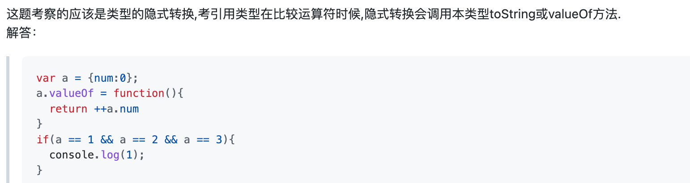

1、vant 和element-ui中的弹出层（popup/dialog） 是懒加载的过程 created钩子函数只会执行一次 会进行缓存 实例项目 头条 回复效果

2、echarts图切换时会复用当前的div 会导致当前的echarts图还会显示无法隐藏 解决方法：给当前echarts的DOM节点套上一个空的div即可 或者给当前div添加一个key值或者id

3、ie浏览器有时候固定定位的元素会消失 只需要给固定元素前面加上不加定位的空div即可

4、前端控制同端只能登录一个问题：全局监听token变化 若token变化重新调用获取用户信息

5、===和==区别：
		严格等于不会进行隐式转换并且需要值和类型都相等才行
		== 会进行隐式转换执行toString()方法后再去对比

		